# 个人网站 · 页面布局与内容规划迭代方案

> **结论先行**：站点「能用但太薄」——页面骨架只覆盖 4 个栏目（首页/作品/文章/实践），**作品没有详情页、没有独立 About 页、没有联系入口**，且各栏目内容仅 2–3 条。
> 建议本轮以 **「补齐基础设施型板块」** 为主（About 独立页 / 作品详情页 / 联系页），再按你的差异化方向选装 1–2 个特色板块（工具箱 / 摄影集 / 标签聚合）。
> 技术基线不动：Astro 5 + 中英双语 + Apple 风格令牌。内容规划部分待你补充详细要求后回填第七节。

---

## 一、现状诊断

### 1.1 既有资产盘点

| 维度 | 现状 | 评价 |
| ---- | ---- | ---- |
| 技术栈 | Astro ^5.0.0（静态、SSR 关）、零 UI 框架依赖、zod schema 校验、glob 双语集合 | ✅ 轻、稳、可长期维护 |
| 部署 | Netlify（`netlify.toml`，Node 22，发布 `dist`）+ GitHub `JasonWithMiracle/personal-site` 自动构建 | ✅ 已上线 |
| 线上地址 | https://magnificent-toffee-7658ee.netlify.app/ | ✅ |
| 页面 | 12 个双语页面：首页 `/`、作品集 `/portfolio/`、文章 `/articles/`（列表+详情）、实践 `/practice/`（列表+详情） | ⚠️ 覆盖不足 |
| 组件 | `Header / Footer / ProjectCard / ArticleCard / PracticeCard` + `BaseLayout` | ✅ 可复用 |
| 风格令牌 | `src/styles/global.css` 的 `:root`，Apple 设计语言（留白、淡入 `.reveal`） | ✅ 换肤只需改令牌 |
| 双语机制 | `src/lib/i18n.ts`（`UI` 文案表 + `toggleLocale` 路由切换） | ⚠️ 新增页面必须同步改 3 处 |
| 内容管线 | `scripts/import-practice.mjs` 从 Obsidian 知识库导入实践经验 | ✅ 已通 |

### 1.2 内容存量（**偏薄，是本轮最大约束**）

| 集合 | 中文 | 英文 | 说明 |
| ---- | ---- | ---- | ---- |
| about | 1 | 1 | 仅首页一个 section 使用 |
| projects | 3 | 3 | `design-system` / `note-app` / `reading-platform` |
| articles | 3 | 3 | `astro-blogging` / `reading-notes` / `why-simple` |
| practice | 2 | 2 | `feishu-kb-restructure` / `modao-requirement-prototype` |

### 1.3 缺口清单（方案要解决的问题）

| # | 缺口 | 影响 | 严重度 |
| - | ---- | ---- | ------ |
| G1 | **作品无详情页** —— `src/pages/portfolio.astro` 只是列表，无 `[...id].astro` | 卡片点进去无处可去，只能跳外链；作品无法承载过程、结果、复盘 | 高 |
| G2 | **无独立 About 页** —— About 只是首页一段 `bio` + 技能标签 | 求职场景下「我是谁」信息密度不够，简历/经历无处安放 | 高 |
| G3 | **无联系入口** —— Footer 未暴露邮箱/社交链接 | 访客（HR）无法触达，站点转化闭环缺失 | 高 |
| G4 | **无标签/聚合维度** —— 内容只能按栏目线性浏览 | 内容渐多后无法横向检索 | 中 |
| G5 | **无差异化板块** —— 你的独特资产（238 个自建 skill / MCP、Obsidian 知识库、VoiceDesk、9 年人像摄影）在站点上完全不可见 | 站点与「通用模板站」无区别 | 中 |
| G6 | **导航容量已到顶** —— 现有 4 项，新增板块后横向会撑爆 | 需提前规划导航分层 | 中 |
| G7 | 历史遗留：`缺测试与 CDN 降级`（Mermaid 依赖 CDN） | 离线/国内访问风险 | 低（本轮不处理，或顺带做本地兜底） |

---

## 二、信息架构（IA）方案

### 2.1 导航分层策略

新增板块后导航项会达到 6–8 个，横向排列在移动端必然溢出。建议采用 **「主导航 5 项 + 页脚次级入口」** 的分层：

- **主导航（Header）**：首页 · 作品 · 文章 · 实践 · 关于
- **高频转化入口**：联系（放 Header 右侧，`.btn` 样式，紧邻语言切换）
- **页脚次级入口**：工具箱 / 摄影 / 标签 / Now / 时间线（不占主导航）

### 2.2 路由总图

```mermaid
graph TD
    ROOT["/ · /en/ 首页"] --> HERO["Hero 姓名·角色·Tagline·双 CTA"]
    ROOT --> ABOUT_SEC["关于摘要 + 技能标签"]
    ROOT --> FEAT["精选作品 (featured=true)"]
    ROOT --> RECENT["最近文章 (取 3 条)"]
    ROOT --> NOW_SEC["Now 当前在做 · 可选模块"]

    ROOT --> P["/portfolio/ 作品列表"]
    P --> PD["/portfolio/zh/&lt;slug&gt;/ 作品详情 ★新增"]
    ROOT --> A["/articles/ 文章列表"]
    A --> AD["/articles/zh/&lt;slug&gt;/ 文章详情"]
    ROOT --> PR["/practice/ 实践列表(按类分组)"]
    PR --> PRD["/practice/zh/&lt;slug&gt;/ 实践详情"]
    ROOT --> AB["/about/ 关于 ★新增"]
    ROOT --> CT["/contact/ 联系 ★新增"]
    ROOT --> TB["/toolbox/ 工具箱 ★候选"]
    ROOT --> PH["/photography/ 摄影 ★候选"]
    ROOT --> TG["/tags/ 标签聚合 ★候选"]

    style PD fill:#eef4fd,stroke:#0071e3
    style AB fill:#eef4fd,stroke:#0071e3
    style CT fill:#eef4fd,stroke:#0071e3
    style TB fill:#fff5e6,stroke:#ff9f0a
    style PH fill:#fff5e6,stroke:#ff9f0a
    style TG fill:#fff5e6,stroke:#ff9f0a
```



> 路由沿用现有约定：**栏目页**中文无前缀、英文 `/en` 前缀；**详情页**语言段内嵌 `/<section>/<lang>/<slug>/`（`toggleLocale` 已实现此规则）。

---

## 三、新增板块候选池

| 板块 | 路由（zh / en） | 解决缺口 | 内容依赖 | 工作量 | 建议优先级 |
| ---- | --------------- | -------- | -------- | ------ | ---------- |
| **About 独立页** | `/about/` · `/en/about/` | G2 | 中（复用 `about.md` + 简历素材） | 低 | **P0** |
| **作品详情页** | `/portfolio/<lang>/<slug>/` | G1 | 中（每件作品补详情正文） | 低（复用文章详情写法） | **P0** |
| **联系页** | `/contact/` · `/en/contact/` | G3 | 低（邮箱/社交链接） | 低 | **P0** |
| **工具箱 / Lab** | `/toolbox/` · `/en/toolbox/` | G5 | 中（skill/MCP/项目清单） | 中 | P1 |
| **摄影集** | `/photography/` · `/en/photography/` | G5 | **高（需图片资产 + 版权/加载考量）** | 中 | P1 |
| **标签聚合页** | `/tags/[tag]/` | G4 | 低（自动聚合，零新增内容） | 低 | P1 |
| **Now 页** | `/now/` · `/en/now/` | G5 | 低（一段近况） | 低 | P2 |
| **时间线** | `/timeline/` · `/en/timeline/` | G2 | 中（经历条目） | 中 | P2 |
| **站内搜索** | 搜索入口 | G4 | 低（静态索引 JSON） | 中 | P2 |

---

## 四、推荐组合（待你拍板）

| 方案 | 内容 | 特点 | 适配场景 |
| ---- | ---- | ---- | -------- |
| **A · 稳基建**（推荐） | P0 三件（About + 作品详情 + 联系）+ 标签聚合 | 内容依赖最低、风险最小、闭环完整 | 想先把站点补成「完整可用」，内容稍后填 |
| **B · 差异化** | A + 工具箱（Lab） | 把 238 个 skill / MCP / VoiceDesk / VDBWIKI 变成站点独家内容 | 面向 AI 岗位求职，要突出工程与 Agent 能力 |
| **C · 视觉优先** | A + 摄影集 | 9 年人像摄影做视觉锤 | 想强化个人品牌辨识度 |
| **D · 全量** | A + B + C | 板块齐全 | 内容供给充足时 |

> **我的建议：B**。理由——工具箱板块的内容你已经有了（skill 清单、MCP、项目台账都在知识库里，可脚本化同步，边际成本最低），且它是别人抄不走的差异化；摄影集看着好但需要整批图片资产与加载优化，建议单开一轮。

---

## 五、页面布局设计

### 5.1 About 独立页（P0）

```
┌──────────────────────────────────────────────┐
│ 页面标题「关于我」 + 副标题 tagline            │  ← .page-title / .page-sub
├──────────────────────┬───────────────────────┤
│ 左栏 · 主内容         │ 右栏 · 侧栏（sticky）  │
│ ① 简介长文 .prose     │ ④ 头像 .avatar         │
│ ② 经历时间线          │ ⑤ 联系方式 mini        │
│ ③ 技能矩阵（分组）    │ ⑥ 简历下载 CTA         │
└──────────────────────┴───────────────────────┘
```

- 区块清单：`Hero标题` → `简介(prose)` → `技能矩阵(按 求职方向/AI工程/工具链/摄影 分组，复用 .tags)` → `经历时间线` → `简历下载 CTA`
- 移动端：双栏塌缩为单栏，侧栏移到主内容下方
- 数据源：`about` 集合扩展字段（见 6.2）

### 5.2 作品详情页（P0）

```
┌──────────────────────────────────────────────┐
│ ← 返回作品集   ·   语言切换（内嵌）            │  ← .back / .lang-switch-inline
├──────────────────────────────────────────────┤
│ 封面图（可选）                                 │  ← .post-cover
├──────────────────────────────────────────────┤
│ 标题 + 元信息（年份 · 标签 · 外链）            │  ← .post-title / .post-meta
├──────────────────────────────────────────────┤
│ 正文 .prose（背景 / 我的角色 / 过程 / 结果）    │
├──────────────────────────────────────────────┤
│ 底部：上一篇 / 下一篇 作品                      │
└──────────────────────────────────────────────┘
```

- **实现要点**：`src/pages/portfolio.astro` 必须**改写为** `src/pages/portfolio/index.astro`，才能与 `[...id].astro` 共存（否则路由冲突）；详情页写法直接复用 `articles/[...id].astro`
- 卡片 `ProjectCard` 的链接从「外链 or 无」改为「优先跳详情页，外链作为卡片上的独立小链接」

### 5.3 联系页（P0）

```
┌──────────────────────────────────────────────┐
│ 「聊聊？」标题 + 一句邀请语                     │
├──────────────────────────────────────────────┤
│ 联系方式卡片组（网格）：                        │
│  ✉ 邮箱  ·  💬 微信  ·  🔗 GitHub  ·  in LinkedIn │
├──────────────────────────────────────────────┤
│ 说明：用途（求职合作 / 技术交流 / 摄影约拍）     │
└──────────────────────────────────────────────┘
```

- 不做后端表单（静态站成本/风控考量），用 `mailto:` + 外链卡片
- 邮箱建议展示为文本而非裸链接（可后续加简单反爬）

### 5.4 工具箱 Lab（P1 · 方案 B 的核心）

```
┌──────────────────────────────────────────────┐
│ 标题「工具箱」+ 副标题                          │
├──────────────────────────────────────────────┤
│ 统计条：238 skill · N MCP · N 项目 · N 知识库页 │  ← 数字卡片
├──────────────────────────────────────────────┤
│ 分组浏览：                                     │
│  ▸ 自建 Skill（按领域分组 + 搜索/筛选框）        │
│  ▸ MCP / 工具链                                │
│  ▸ 开源项目（VoiceDesk / VDBWIKI / ds-router） │
└──────────────────────────────────────────────┘
```

- 数据源建议：新增 `src/content/toolbox/` 集合 + 一个导入脚本（对齐现有 `import-practice.mjs` 的做法，从知识库/skills 目录生成）
- 若希望零维护：可退化为「静态清单页」，直接由脚本一次性生成

### 5.5 首页的连带调整（任何新增方案都要做）

- Hero 增加第三个 CTA（「联系我」→ `/contact/`）
- 关于摘要区块底部加「更多关于我 →」链接
- 新增 **Now 模块（可选）**：一段 2–3 行的「当前在做」，成本极低、更新频率高，能让站点显得「活着」

---

## 六、改动影响清单

### 6.1 必改文件

| 文件 | 改动 | 说明 |
| ---- | ---- | ---- |
| `src/lib/i18n.ts` | `UI.nav` 增加 `about`/`contact`（及候选板块键）；补各栏目 `desc` 文案；`toggleLocale` 增补新详情页的语言段规则 | **双语站新增页面的必改项**，漏改会导致语言切换跳错 |
| `src/components/Header.astro` | `navItems` 增加条目；联系做成右侧 `.btn` | 导航容量控制（主导航不超过 5 项） |
| `src/components/Footer.astro` | 增加次级入口（工具箱/摄影/标签/Now）与邮箱 | 分层导航的落点 |
| `src/pages/portfolio.astro` → `src/pages/portfolio/index.astro` | 文件改路径 | **否则与 `[...id].astro` 路由冲突** |
| `src/pages/portfolio/[...id].astro` | 新增 | 复用文章详情实现 |
| `src/pages/about.astro` + `src/pages/en/about.astro` | 新增 | 双份（栏目页中英各一） |
| `src/pages/contact.astro` + `src/pages/en/contact.astro` | 新增 | 同上 |
| `src/content.config.ts` | `about` 集合扩展字段；新增 `toolbox` 集合（若选方案 B） | schema 见 6.2 |
| `src/styles/global.css` | 新增少量类：`.page-hero` / `.two-col` / `.sticky-side` / `.contact-grid` / `.stat-row` | 令牌不变，只加布局类 |
| `src/lib/site.ts` | `SITE_VERSION` +1 | 页脚版本号 |

### 6.2 内容 Schema 增补建议

```ts
// about 集合扩展（支撑 About 页）
experience: z.array(z.object({
  period: z.string(),      // "2024 - 至今"
  role: z.string(),
  org: z.string(),
  summary: z.string(),
})).default([]),
skillGroups: z.array(z.object({
  group: z.string(),       // "AI 工程" / "产品" / "摄影"
  items: z.array(z.string()),
})).default([]),
resume: z.string().optional(),   // 简历文件链接（public/ 下或外链）
contacts: z.array(z.object({ label: z.string(), value: z.string(), href: z.string().optional() })).default([]),
```

> 全部 `.default([])` / `.optional()` —— **保证不破坏现有 `about/zh.md` 与 `about/en.md`**，可渐进填充。

---

## 七、内容规划框架（**待你补充详细要求后回填**）

本节暂列框架与「需要你提供的信息」，你补充要求后我在 v0.2 里细化成逐页文案清单。

| 板块 | 需要的内容资产 | 当前是否已有 | 需你确认的点 |
| ---- | -------------- | ------------ | ------------ |
| About | 个人简介长文、经历条目、技能分组、简历文件 | 部分（`about.md` 有 bio/skills；简历 v1.0.4 存在） | 简历是否公开下载？经历写到什么颗粒度？ |
| 作品详情 | 每件作品的 背景/角色/过程/结果 | 无（仅 summary） | 现有 3 件是否都补详情？是否新增真实项目（VoiceDesk / VDBWIKI / ds-router）？ |
| 联系 | 邮箱、微信、GitHub、LinkedIn | 部分 | 邮箱是否明文展示？ |
| 工具箱 | skill 清单、MCP 清单、项目清单 | 有（知识库/skills 目录） | 展示粒度（全量 238 个 / 精选 Top N）？是否自动同步？ |
| 摄影集 | 图片资产 + 说明 | 待确认 | 图片数量、授权、加载策略（懒加载/缩略图）？ |
| 标签 | 无需新增（自动聚合） | — | 标签命名是否要先做一次清洗统一？ |

**待你补充的问题**（我会据此写 v0.2）：
1. 各板块的目标读者是谁（HR / 技术同行 / 泛访客）？不同读者决定信息密度与 CTA 位置。
2. 每个板块希望传达的 1 句话核心信息是什么？
3. 哪些内容可以自动从 Obsidian 知识库同步、哪些必须手写？

---

## 八、分阶段实施计划

| 阶段 | 内容 | 产出 | 验收标准 |
| ---- | ---- | ---- | -------- |
| **M1 · 骨架** | i18n 文案表 + Header/Footer 导航分层 + `portfolio.astro` 改为 `index.astro` | 编译通过，导航 5 项 + 联系按钮，中英切换全站正确 | `npx astro build` 无报错；`/` 与 `/en/` 及新增页语言切换互跳正确 |
| **M2 · P0 三页** | About 页 + 作品详情页 + 联系页 + 首页连带调整 | 三页上线，作品卡片可进详情 | 12→18 页（双语）；作品详情页四要素（标题/元信息/正文/上下篇）齐全 |
| **M3 · 选装板块** | 按你选定的方案（B/C/D）新增工具箱或摄影集 + 标签聚合 | 差异化板块上线 | 内容来源可复现（脚本 or 清单），无空板块 |
| **M4 · 收尾** | 移动端断点复核、SEO/OG、版本号 +1、README 同步、台账登记 | 迭代记录进 `版本迭代台账.md` | 台账新增一行；README 目录结构与路由一致 |

**版本迭代判定**（依据收尾标准四.8）：P0 三页 ≈ 新增 6 个页面 + 导航重构，修改幅度预计 **30%–50% → MINOR，版本 1.1.0**；若同时上工具箱+摄影集则可能触及 >50% → 需评估 **2.0.0**。最终以实际改动幅度核算。

---

## 九、风险与约束

| 风险 | 说明 | 应对 |
| ---- | ---- | ---- |
| 内容供给不足 | 新增板块会放大「内容薄」的问题，空板块比没有更糟 | 严格按 P0→P1 顺序；板块上线前内容必须到位，否则降级为「首页模块」 |
| 双语不同步 | 新增页面最容易漏 en 版与 `toggleLocale` 规则 | M1 先把 i18n 与路由规则一次改全，M2 之后只填内容 |
| 路由冲突 | `portfolio.astro` 与 `[...id].astro` | 按 6.1 先改目录结构 |
| 导航溢出 | 板块变多后移动端排版崩 | 主导航锁 5 项，其余走页脚 |
| Mermaid 依赖 CDN | 历史遗留，国内/离线可能失败 | 本轮可选做本地兜底（不在本方案强制范围） |
| 发布流程 | 项目在 Obsidian vault 内，git 有两个未跟踪项（`40-收尾/`、`版本迭代台账.md`） | 开工前先确认是否纳入版本管理 |

---

## 十、需要你拍板

1. **方案选择**：A（稳基建）/ **B（+工具箱，推荐）** / C（+摄影） / D（全量）
2. **内容要求**：第七节的 3 个问题 + 各板块内容资产确认
3. **开工前置**：`40-收尾/` 与 `版本迭代台账.md` 是否纳入 git 跟踪？
